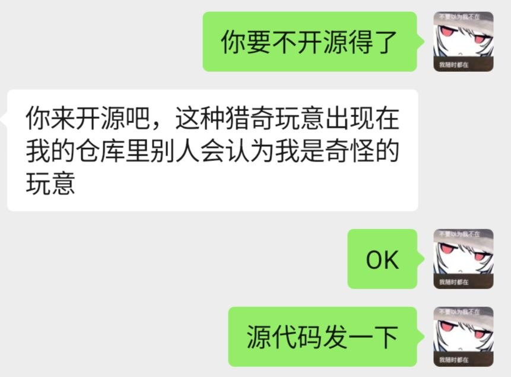

<div align="center">

# 🐾 catify

**让全世界都喵化的 Windows 小玩意**

按下回车键的那一刻，`喵` 就已经在路上了。


[](https://github.com/xiongzikun0106/Catify)


**[github.com/xiongzikun0106/Catify](https://github.com/xiongzikun0106/Catify)**

</div>

---

## 这到底是个啥

`catify` 会安静地挂在后台，装一个全局键盘钩子。从此以后，你**每按一次回车**，它都会抢在回车生效之前，偷偷替你多打一个字：

> **喵**

于是：

| 你以为你发出去的 | 对方实际收到的 |
| --- | --- |
| 在吗 | 在吗喵 |
| 收到，马上处理 | 收到，马上处理喵 |
| 我爱你 | 我爱你喵 |
| （空消息框直接回车） | 喵 |
| 妈，我生活费不够了 | 妈，我生活费不够了喵 |

据不可靠统计，装上 `catify` 之后，你的聊天记录会变成一份猫咪行为观察报告。

## 为什么要开源（重要）

本项目由 GitHub 用户 [@CharlesLiu9441](https://github.com/CharlesLiu9441) 开发。

**但他本人拒绝在自己仓库里公开这个东西**，理由是：这种猎奇玩意出现在他的仓库里，别人会认为他是奇怪的玩意。

于是这份开源的苦差事就落到了我头上。微信聊天记录为证：



> **我**：你要不开源得了
>
> **CharlesLiu9441**：你来开源吧，这种猎奇玩意出现在我的仓库里别人会认为我是奇怪的玩意
>
> **我**：OK
>
> **我**：源代码发一下

所以结论是：**代码是他写的，锅由他来背，仓库先放我这儿。** 有问题找作者，Star 可以给我点。

## 效果演示

```text
你（打完字按回车）    : 今天天气不错            →  对方看到：今天天气不错喵

你（Shift + 回车换行）: 喵

你（长按回车不放）    : 喵喵喵喵喵喵喵喵喵喵喵喵喵喵喵喵

你（在终端里回车）    : PS C:\> ls喵

你（游戏里报点）      : 进攻 A 点喵

你（在搜索框回车）    : 怎么卸载 catify喵
```

规律极其简单：**只要是回车，就送你一个喵。** 回车本身照常工作，它只是被加了条尾巴。

## 原理（真的很简单）

整个程序只有 81 行 Rust，没有任何黑魔法：

1. **`SetWindowsHookExW(WH_KEYBOARD_LL, ...)`** —— 装一个全局低级键盘钩子。低级钩子由系统把按键事件回调给本进程，不需要注入 DLL，也不需要管理员权限。
2. **`WM_KEYDOWN && vkCode == VK_RETURN`** —— 只关心回车，其他键一律放行。
3. **`SendInput` + `KEYEVENTF_UNICODE`** —— 直接以 Unicode 编码把 `喵` 注入系统输入流，绕开键盘布局、IME 和一切中间商。
4. **`if !info.flags.contains(LLKHF_INJECTED)`** —— 全项目最关键的一行。`SendInput` 注入的按键会被自己的钩子再次看到，这个判断保证它不会自己触发自己，否则你会收获一屏幕的喵。
5. **`CreateMutexW(L"Global\\catify-mutex")`** —— 全局互斥体，防止你手贱双击两次养出两只猫。
6. **`#![windows_subsystem = "windows"]`** —— 不弹黑框。运行起来悄无声息，像猫一样。

它**不拦截**回车（`CallNextHookEx` 照常放行），只是在回车之前塞了一个喵进去。

## 快速开始

### 方式一：直接用现成的

仓库里已经附了编译好的 [`catify.exe`](https://github.com/xiongzikun0106/Catify/raw/main/catify.exe)（31 KB，`strip` + `lto` + `opt-level = "z"`）。点链接直接下载，或者 clone 下来双击运行，然后开始喵。

> ⚠️ 双击之后**什么都不会发生** —— 这就是它的正常工作状态。没有窗口、没有托盘图标，只有一只看不见的猫。

### 方式二：自己编译

```powershell
git clone https://github.com/xiongzikun0106/Catify.git
cd Catify
cargo build --release
# 产物：target\release\catify.exe
```

需要 Rust 1.85+（2024 edition），依赖只有一个 `windows` crate。

## 怎么关掉它（必读）

程序没有窗口、没有托盘图标、没有退出菜单 —— 因为它觉得猫不该被关起来。想让它停下来，只能：

```powershell
taskkill /IM catify.exe /F
```

或者打开任务管理器，找到 `catify.exe`（只占几 MB 内存），结束任务。

## 常见问题

**Q：为什么我发出去的是「xxx喵」，而不是「喵xxx」？**\
A：因为钩子在回车真正到达目标窗口之前就把喵注入了。你先打完字，钩子补上尾巴，然后回车才把整句话发出去。这不是 bug，这是命中注定。

**Q：为什么 Shift+回车、Ctrl+回车、小键盘回车也都会喵？**\
A：因为代码只认 `VK_RETURN`，完全不看修饰键。想让换行键逃过一劫的话，自己加个 `GetAsyncKeyState(VK_SHIFT)` 判断（然后欢迎提 PR，我保证不合并）。

**Q：为什么杀毒软件和游戏反作弊看我的眼神不对？**\
A：全局键盘钩子 + 模拟按键，这两个特征叠在一起，长得确实很像键盘记录器。它实际只做一件事：往你的输入流里塞喵。但如果你在打排位，建议先关掉它 —— 不然队友会以为你在卖萌。

**Q：会不会死循环，喵出一整个屏幕？**\
A：不会，见原理第 4 条。作者在这件事上异常清醒。

**Q：为什么有时候喵不出来？**\
A：Unicode 注入走的是系统输入流，绝大多数程序都没问题；但在独占全屏程序、UAC 提权窗口、以及安全桌面（Ctrl+Alt+Del）里，钩子根本收不到按键。喵也有够不到的地方。

**Q：它会记录我的按键吗？**\
A：不会。源码 81 行，通读一遍只要两分钟，它连一个文件都不写。不放心就自己读 `src/main.rs`。

## 为什么叫 catify

`catify` = **猫化**。动词后缀 `-ify` 加在 `cat` 后面，念作 /ˈkætɪfaɪ/，又短又顺口。

这个程序干的事情，准确地说不是「出现了一只猫」，而是**「把回车这个动作猫化」**。所以它天然就是个动词，`catify` 的语义、词性、长度全都踩在点上，比 `meow.exe`、`EnterNya`、`喵喵机` 之类的名词式命名更贴切。

客观说一句：这个名字并不是全网唯一 —— npm 上有 `catify-cli`，Chrome 商店和 Firefox 上也有叫 `catify` 的扩展，但它们干的是「把网页图片换成猫」。同一个词，两个方向：**它们把图片变成猫，我们把回车变成喵。** 不算撞车。

**结论：这名字挺合适，建议别改。** 真要嫌它不够怪，唯一合格的备选是 `meowify`。

## 免责声明

- 本程序只做一件事：往你的输入流里塞喵。
- 但它用的 API 和键盘记录器是同一套，请自行判断你的使用场景。
- 请勿用于考试、面试、线上对喷等「喵」会造成严重后果的场合。
- 所有因为喵而丢掉的 offer、被踢出的群聊、被队友举报的对局，作者和开源者概不负责。

## 许可证

[MIT](LICENSE) —— 随便用，随便改，随便打包去卖，保留版权声明就行。

Copyright (c) 2026 [@CharlesLiu9441](https://github.com/CharlesLiu9441)（原作者）、[@xiongzikun0106](https://github.com/xiongzikun0106)（代为开源）。

按 MIT 的字面意思，本软件「按原样提供」，不附带任何担保 —— 所以因为喵丢掉的 offer，依然不赔。

---

<div align="center">

**如果这个小玩意让你笑了一下，就给个 Star 吧。** ⭐

*喵。*

</div>
